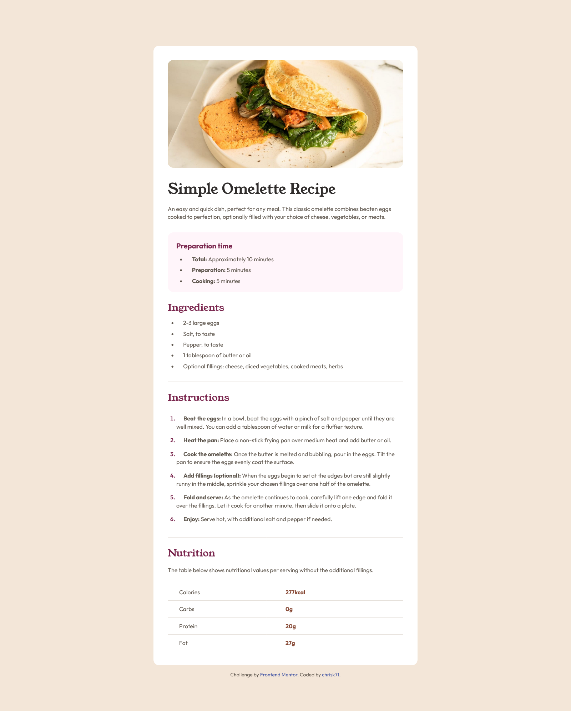

# Frontend Mentor - Recipe page solution

This is a solution to the [Recipe page challenge on Frontend Mentor](https://www.frontendmentor.io/challenges/recipe-page-KiTsR8QQKm). Frontend Mentor challenges help you improve your coding skills by building realistic projects. 

## Table of contents

- [Overview](#overview)
  - [The challenge](#the-challenge)
  - [Screenshot](#screenshot)
  - [Links](#links)
- [My process](#my-process)
  - [Built with](#built-with)
  - [What I learned](#what-i-learned)
  - [Continued development](#continued-development)
  - [Useful resources](#useful-resources)
- [Author](#author)
- [Acknowledgments](#acknowledgments)

## Overview

### Screenshot

### Links

- Solution URL: [My Recipe Page Solution](https://your-solution-url.com)
- Live Site URL: [Netlify](https://your-live-site-url.com)

## My process

### Built with

- Semantic HTML5 markup
- CSS custom properties
- Flexbox
- CSS Grid
- Mobile-first workflow

### What I learned

With this challenge I learned how to style ordered and unordered lists and media queries for mobile screens.

### Continued development

I will continue to hone my skills using CSS grid/flexbox and get a better understanding of media queries.

### Useful resources

- [Recipe Page Project | edsHTML](https://www.youtube.com/watch?v=wF2DLQGeJS0) - I tried using a table for the nutritional info section but had difficulty. I checked out edsHTML tutorial and it was much easier to style using paragraphs for each text element in the HTML file.

## Author

- Frontend Mentor - [@chrisk71](https://www.frontendmentor.io/profile/yourusername)

## Acknowledgments

Thanks to edsHTML on YouTube for the idea to use paragraphs to style the nutritional section.
